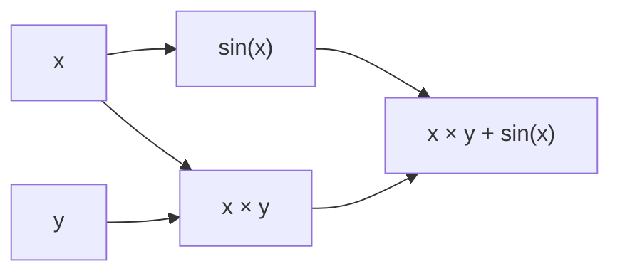

每个学过高等数学的大学生都知道**最小量**这一名词，但很少思考最小量有多小。计算机学科专业的同学可能会想到使用浮点数来表示最小量，比如常见的使用 `1e-12` 作为最小量。但这引入了浮点数精度问题以及数学上的不严谨。

这篇博客的目标是实现一个**自动微分器**，通过表达式自动求导数，重新审视并定义**最小量**的概念。

> 项目仓库：https://github.com/M4yGem1ni/AutomaticDifferentiation
<!-- more -->

## 开始

作为一个计算机科学与技术的学生，我相信你一定熟练掌握 `numpy` 这种科学计算库。

假如你现在有一个函数 $f(x) = e^{\sin(x)}$，你需要对其求导。我们小学二年级就学过导数的定义：

$$
f'(x) = \frac{f(x + \varepsilon) - f(x)}{\varepsilon}
$$

由于计算机学科的学生经常使用浮点数，于是首先想到的方法是定义一个阈值，比如 `1e-12` 作为最小量 $\varepsilon$，直接计算：

$$
f'(x) \approx \frac{f(x + 1e^{-12}) - f(x)}{1e^{-12}}
$$

当

$$
\lvert N_1 - N_2 \rvert \le 1e^{-12}
$$

时，认为 $N_1$ 与 $N_2$ 相等。

但是，只要你使用浮点数，就会面临精度问题。例如计算机计算 $10^{10} + 10^{-12} = 10^{10}$，导致求导公式的分子直接为零，导数恒为 0。

## 无穷小量的数学定义

在数学上，无穷小量的定义是：

> $\forall \varepsilon > 0$，$\exists \delta > 0$，当 $0 < \lvert x - x_0 \rvert < \delta$ 时，恒有 $\lvert f(x) \rvert < \varepsilon$。

观察这个定义我们不难发现：**没有办法使用一个确切的数值作为最小量**。如果使用 `1e-12`，则依旧可以找到 `1e-15` 比 `1e-12` 更小，以此类推，无穷无尽。

因此，想要正确地表示最小量，我们只能使用一个**未知的符号**来表示，数学中使用 $\varepsilon$。

## 定义最小量运算规则

我们需要抛弃使用数值的方式定义最小量，为最小量定制一套运算规则，让它参与函数表达式计算。这里直接给出答案：

$$
\varepsilon + \varepsilon = 2\varepsilon
$$
$$
\varepsilon \times \varepsilon = 0
$$

由于无穷小量已经足够小了，所以只保留一阶无穷小量，丢弃所有的高阶无穷小量，同时保证一阶无穷小量参与计算。

### 对偶数定义

在这个基础上，我们需要两个维度的信息来表示自变量 $x$，对 $x$ 的类型进行重定义：

```cpp
struct Dual {
    double value;  // 数值部分
    double deriv;  // 导数部分

    Dual(double v = 0.0, double d = 0.0) : value(v), deriv(d) {}
};
```

这种数据类型被称为**对偶数**（Dual Number），形式为 $a + b\varepsilon$。

### 加减乘除运算规则

根据上方给出的两条定义，我们重定义 `+`、`-`、`*`、`/` 这四种基础运算法则：

```cpp
inline Dual operator+(const Dual& a, const Dual& b) {
    return Dual(a.value + b.value, a.deriv + b.deriv);
}

inline Dual operator-(const Dual& a, const Dual& b) {
    return Dual(a.value - b.value, a.deriv - b.deriv);
}

inline Dual operator*(const Dual& a, const Dual& b) {
    return Dual(a.value * b.value,
        a.value * b.deriv + a.deriv * b.value);
}

inline Dual operator/(const Dual& a, const Dual& b) {
    return Dual(a.value / b.value,
        (a.deriv * b.value - a.value * b.deriv) / (b.value * b.value));
}
```

### 初等函数运算规则

类似 `sin(x)` 和 `exp(x)` 这种初等函数，无法使用之前的两条定义给出新的运算规则。这里我们引入**泰勒公式**：

$$
f(x_0 + \Delta x) = f(x_0) + f'(x_0)\Delta x + \frac{f''(x_0)}{2!}(\Delta x)^2 + \cdots
$$

任何初等函数都可以使用泰勒公式展开。令 $\Delta x = \varepsilon$，由于 $\varepsilon^2 = 0$，只需保留常数项和一次项即可。按照这种方法，可以轻松定义所有初等函数：

```cpp
// 三角函数
inline Dual sin(const Dual& x) {
    return Dual(std::sin(x.value), std::cos(x.value) * x.deriv);
}

inline Dual cos(const Dual& x) {
    return Dual(std::cos(x.value), -std::sin(x.value) * x.deriv);
}

// 指数和对数
inline Dual exp(const Dual& x) {
    double exp_val = std::exp(x.value);
    return Dual(exp_val, exp_val * x.deriv);
}

inline Dual log(const Dual& x) {
    return Dual(std::log(x.value), x.deriv / x.value);
}

// 幂函数
inline Dual pow(const Dual& x, double n) {
    double pow_val = std::pow(x.value, n);
    return Dual(pow_val, n * std::pow(x.value, n - 1) * x.deriv);
}

// 反三角函数
inline Dual asin(const Dual& x) {
    return Dual(std::asin(x.value), x.deriv / std::sqrt(1 - x.value * x.value));
}

inline Dual acos(const Dual& x) {
    return Dual(std::acos(x.value), -x.deriv / std::sqrt(1 - x.value * x.value));
}

inline Dual atan(const Dual& x) {
    return Dual(std::atan(x.value), x.deriv / (1 + x.value * x.value));
}
```

## 前向自动微分

### 单变量全导

定义了对偶数，下一步就是使用已定义好的初等函数，构造待求导的函数：

```cpp
Dual f(Dual x) {
    return x + x * x + pow(x, 3);
}
```

计算时只需设置 `x.deriv = 1`，即为自变量 $x$ 添加一个最小量。在计算过程中，最小量由自变量传递到因变量，最终得到 `y.deriv` 即为导数值。

### 多变量偏导

```cpp
Dual g(Dual x, Dual y, Dual z) {
    return pow(x, 3) + pow(y, 2) + z + cos(x * y * z);
}
```

当出现多个自变量时，依次遍历每个自变量，分别将 `deriv = 1` 写入，即可得到每个自变量的偏导。依次写入向量，得到的就是该函数的**梯度**。

### 模板处理函数

最后使用模板，不限制自变量的数量：

```cpp
ADResult diff(const Func& f, Args... args) {
    ADResult res;
    constexpr size_t N = sizeof...(Args);
    res.gradient.resize(N);

    // 1. 计算函数值（所有导数为 0）
    Dual value_res = f(Dual((double)args, 0.0)...);
    res.value = value_res.value;

    // 2. 对每个输入变量求偏导（seed 依次设为 1）
    double args_arr[] = { (double)args... };

    // 梯度
    [&]<size_t... Is>(std::index_sequence<Is...>) {
        ([&]() {
            // 创建 Dual 输入，第 Is 个变量导数=1，其余=0
            Dual inputs[N];
            for (size_t j = 0; j < N; ++j)
                inputs[j] = Dual(args_arr[j], j == Is ? 1.0 : 0.0);
            // 用内层 index_sequence 展开所有 N 个参数传给 f
            res.gradient[Is] = [&]<size_t... Js>(std::index_sequence<Js...>) {
                return f(inputs[Js]...).deriv;
            }(std::make_index_sequence<N>{});
        }(), ...);
    }(std::make_index_sequence<N>{});

    // 散度
    res.divergence = 0.0;
    [&]<size_t... Is>(std::index_sequence<Is...>) {
        ([&]() {
            res.divergence += [&]<size_t... Js>(std::index_sequence<Js...>) {
                return res.gradient[Is]; // 这里直接用梯度值，因为散度是梯度的和
            }(std::make_index_sequence<N>{});
        }(), ...);
    }(std::make_index_sequence<N>{});
    return res;
}
```

## 后向自动微分

学习了前向自动微分，我们不难发现：求函数的偏导，需要遍历所有的自变量才可以。当自变量数量非常大，而因变量的数量比较少时，可以使用**后向自动微分**。

本质上两者的原理一样，后向自动微分是在遍历因变量的基础上，加入了链式法则。

### 链式节点

前向自动微分中，对偶数在计算过程中同时携带了数值和导数。

在后向自动微分中，我们无法直接通过自变量的变化计算因变量。因此，首先进行一次正向计算，将数值和计算方法存入每一级中，让每一步计算变成一个**节点**。

正向走到因变量处后，依次为每个因变量提供一个最小量，通过每一级节点中保存的计算公式，倒推前一级对后一级变化的贡献。贡献由因变量层通过中间的节点传递到最表层，即可通过遍历因变量，直接确定自变量的梯度。

以 $f(x, y) = x \times y + \sin(x)$ 为例，其计算过程如下：



### 节点定义
```cpp
struct Node {
    std::shared_ptr<NodeData> ptr;

    Node() = default;
    explicit Node(double v);

    double value() const;
    double gradient() const;
    void add_gradient(double g) const;
    void set_gradient(double g) const;
    const std::vector<Node>& inputs() const;
    std::vector<Node>& inputs();
    std::function<void()>& backward();
    const std::function<void()>& backward() const;
};

struct NodeData {
    double value;
    double gradient;
    std::vector<Node> inputs;
    std::function<void()> backward;  // 正向时保存计算函数，反向时调用

    explicit NodeData(double v) : value(v), gradient(0.0) {}
};
```

### 计算过程

```cpp
template <typename Func, typename... Args>
ADResult diff(const Func f, Args... args) {
    ADResult res;

    // 1. 创建输入节点
    std::vector<Node> inputs;
    inputs.reserve(sizeof...(Args));
    (inputs.emplace_back((double)args), ...);

    // 2. 正向计算
    Node output = [&]<size_t... Is>(std::index_sequence<Is...>) {
        return f(inputs[Is]...);
    }(std::make_index_sequence<sizeof...(Args)>{});

    // 3. 反向传播
    backward(output);

    // 4. 提取结果
    res.value = output.value();
    for (auto& in : inputs)
        res.gradient.push_back(in.gradient());

    // 散度
    res.divergence = 0.0;
    for (const auto& g : res.gradient)
        res.divergence += g;

    // 旋度（标量场的旋度始终为 0）
    res.curl.resize(inputs.size());
    for (size_t i = 0; i < inputs.size(); ++i)
        res.curl[i] = 0.0;

    return res;
}
```

